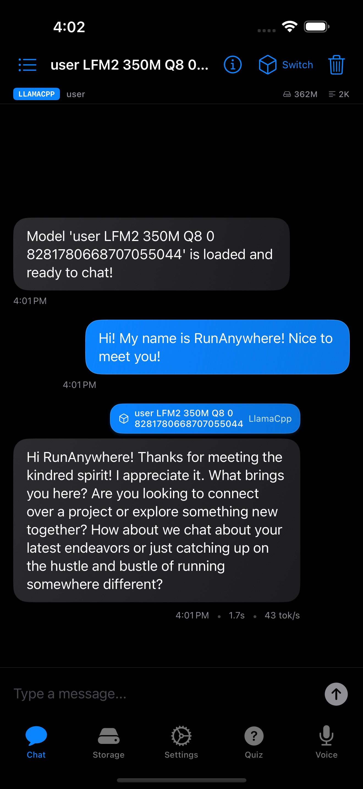
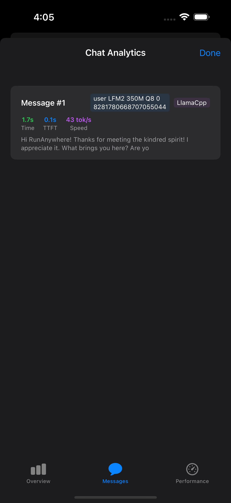
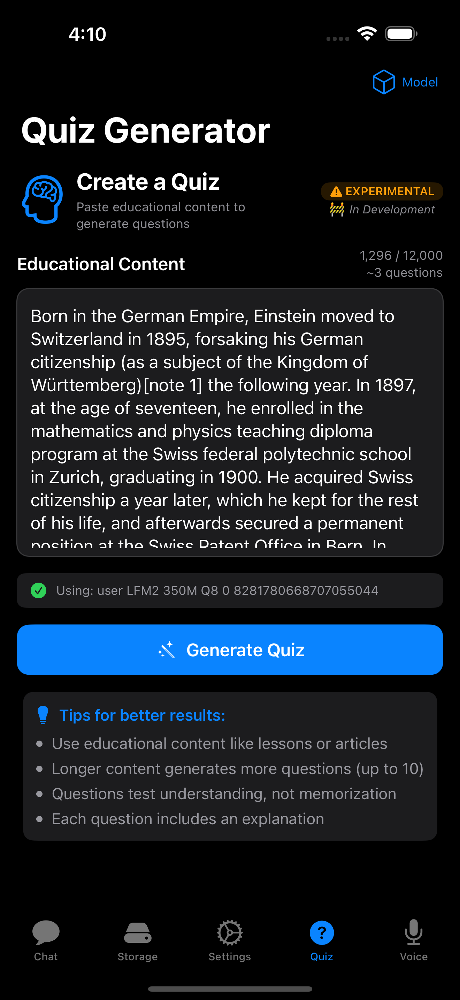
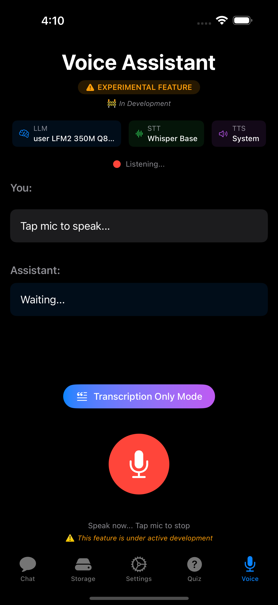

<p align="center">
  
</p>

<h1 align="center">RunAnywhere</h1>

<p align="center">
  <strong>On-device AI for mobile apps.</strong><br/>
  Run LLMs, speech-to-text, and text-to-speech locally—private, offline, fast.
</p>

<p align="center">
  <a href="https://apps.apple.com/us/app/runanywhere/id6756506307">
    
  </a>
  &nbsp;
  <a href="https://play.google.com/store/apps/details?id=com.runanywhere.runanywhereai">
    
  </a>
</p>

<p align="center">
  <a href="https://github.com/RunanywhereAI/runanywhere-sdks/stargazers"></a>
  <a href="LICENSE"></a>
  <a href="https://discord.gg/N359FBbDVd"></a>
</p>

<p align="center">
  
  &nbsp;&nbsp;
  
  &nbsp;&nbsp;
  
  &nbsp;&nbsp;
  
</p>

---

## What is RunAnywhere?

RunAnywhere lets you add AI features to your mobile app that run entirely on-device:

- **LLM Chat** — Llama, Mistral, Qwen, SmolLM, and more
- **Speech-to-Text** — Whisper-powered transcription
- **Text-to-Speech** — Neural voice synthesis
- **Voice Assistant** — Full STT → LLM → TTS pipeline

No cloud. No latency. No data leaves the device.

---

## SDKs

| Platform | Status | Installation | Documentation |
|----------|--------|--------------|---------------|
| **Swift** (iOS/macOS) | Stable | [Swift Package Manager](#swift-ios--macos) | [docs.runanywhere.ai/swift](https://docs.runanywhere.ai/swift/introduction) |
| **Kotlin** (Android) | Stable | [Gradle](#kotlin-android) | [docs.runanywhere.ai/kotlin](https://docs.runanywhere.ai/kotlin/introduction) |
| **React Native** | Beta | [npm](#react-native) | [docs.runanywhere.ai/react-native](https://docs.runanywhere.ai/react-native/introduction) |
| **Flutter** | Beta | [pub.dev](#flutter) | [docs.runanywhere.ai/flutter](https://docs.runanywhere.ai/flutter/introduction) |

---

## Quick Start

### Swift (iOS / macOS)

```swift
import RunAnywhere
import LlamaCPPRuntime

// 1. Initialize
LlamaCPP.register()
try RunAnywhere.initialize()

// 2. Load a model
try await RunAnywhere.downloadModel("smollm2-360m")
try await RunAnywhere.loadModel("smollm2-360m")

// 3. Generate
let response = try await RunAnywhere.chat("What is the capital of France?")
print(response) // "Paris is the capital of France."
```

**Install via Swift Package Manager:**

```
https://github.com/RunanywhereAI/runanywhere-sdks
```

[Full documentation →](https://docs.runanywhere.ai/swift/introduction) · [Source code](sdk/runanywhere-swift/)

---

### Kotlin (Android)

```kotlin
import com.runanywhere.sdk.public.RunAnywhere
import com.runanywhere.sdk.public.extensions.*

// 1. Initialize
LlamaCPP.register()
RunAnywhere.initialize(environment = SDKEnvironment.DEVELOPMENT)

// 2. Load a model
RunAnywhere.downloadModel("smollm2-360m").collect { println("${it.progress * 100}%") }
RunAnywhere.loadLLMModel("smollm2-360m")

// 3. Generate
val response = RunAnywhere.chat("What is the capital of France?")
println(response) // "Paris is the capital of France."
```

**Install via Gradle:**

```kotlin
dependencies {
    implementation("com.runanywhere.sdk:runanywhere-kotlin:0.1.4")
    implementation("com.runanywhere.sdk:runanywhere-core-llamacpp:0.1.4")
}
```

[Full documentation →](https://docs.runanywhere.ai/kotlin/introduction) · [Source code](sdk/runanywhere-kotlin/)

---

### React Native

```typescript
import { RunAnywhere, SDKEnvironment } from '@runanywhere/core';
import { LlamaCPP } from '@runanywhere/llamacpp';

// 1. Initialize
await RunAnywhere.initialize({ environment: SDKEnvironment.Development });
LlamaCPP.register();

// 2. Load a model
await RunAnywhere.downloadModel('smollm2-360m');
await RunAnywhere.loadModel(modelPath);

// 3. Generate
const response = await RunAnywhere.chat('What is the capital of France?');
console.log(response); // "Paris is the capital of France."
```

**Install via npm:**

```bash
npm install @runanywhere/core @runanywhere/llamacpp
```

[Full documentation →](https://docs.runanywhere.ai/react-native/introduction) · [Source code](sdk/runanywhere-react-native/)

---

### Flutter

```dart
import 'package:runanywhere/runanywhere.dart';
import 'package:runanywhere_llamacpp/runanywhere_llamacpp.dart';

// 1. Initialize
await RunAnywhere.initialize();
await LlamaCpp.register();

// 2. Load a model
await RunAnywhere.downloadModel('smollm2-360m');
await RunAnywhere.loadModel('smollm2-360m');

// 3. Generate
final response = await RunAnywhere.chat('What is the capital of France?');
print(response); // "Paris is the capital of France."
```

**Install via pub.dev:**

```yaml
dependencies:
  runanywhere: ^0.15.11
  runanywhere_llamacpp: ^0.15.11
```

[Full documentation →](https://docs.runanywhere.ai/flutter/introduction) · [Source code](sdk/runanywhere-flutter/)

---

## Sample Apps

Full-featured demo applications demonstrating SDK capabilities:

| Platform | Source Code | Download |
|----------|-------------|----------|
| iOS | [examples/ios/RunAnywhereAI](examples/ios/RunAnywhereAI/) | [App Store](https://apps.apple.com/us/app/runanywhere/id6756506307) |
| Android | [examples/android/RunAnywhereAI](examples/android/RunAnywhereAI/) | [Google Play](https://play.google.com/store/apps/details?id=com.runanywhere.runanywhereai) |
| React Native | [examples/react-native/RunAnywhereAI](examples/react-native/RunAnywhereAI/) | Build from source |
| Flutter | [examples/flutter/RunAnywhereAI](examples/flutter/RunAnywhereAI/) | Build from source |

---

## Features

| Feature | iOS | Android | React Native | Flutter |
|---------|-----|---------|--------------|---------|
| LLM Text Generation | ✅ | ✅ | ✅ | ✅ |
| Streaming | ✅ | ✅ | ✅ | ✅ |
| Speech-to-Text | ✅ | ✅ | ✅ | ✅ |
| Text-to-Speech | ✅ | ✅ | ✅ | ✅ |
| Voice Assistant Pipeline | ✅ | ✅ | ✅ | ✅ |
| Model Download + Progress | ✅ | ✅ | ✅ | ✅ |
| Structured Output (JSON) | ✅ | ✅ | 🔜 | 🔜 |
| Apple Foundation Models | ✅ | — | — | — |

---

## Supported Models

### LLM (GGUF format via llama.cpp)

| Model | Size | RAM Required | Use Case |
|-------|------|--------------|----------|
| SmolLM2 360M | ~400MB | 500MB | Fast, lightweight |
| Qwen 2.5 0.5B | ~500MB | 600MB | Multilingual |
| Llama 3.2 1B | ~1GB | 1.2GB | Balanced |
| Mistral 7B Q4 | ~4GB | 5GB | High quality |

### Speech-to-Text (Whisper via ONNX)

| Model | Size | Languages |
|-------|------|-----------|
| Whisper Tiny | ~75MB | English |
| Whisper Base | ~150MB | Multilingual |

### Text-to-Speech (Piper via ONNX)

| Voice | Size | Language |
|-------|------|----------|
| Piper US English | ~65MB | English (US) |
| Piper British English | ~65MB | English (UK) |

---

## Repository Structure

```
runanywhere-sdks/
├── sdk/
│   ├── runanywhere-swift/          # iOS/macOS SDK
│   ├── runanywhere-kotlin/         # Android SDK
│   ├── runanywhere-react-native/   # React Native SDK
│   ├── runanywhere-flutter/        # Flutter SDK
│   └── runanywhere-commons/        # Shared C++ core
│
├── examples/
│   ├── ios/RunAnywhereAI/          # iOS sample app
│   ├── android/RunAnywhereAI/      # Android sample app
│   ├── react-native/RunAnywhereAI/ # React Native sample app
│   └── flutter/RunAnywhereAI/      # Flutter sample app
│
└── docs/                           # Documentation
```

---

## Requirements

| Platform | Minimum | Recommended |
|----------|---------|-------------|
| iOS | 17.0+ | 17.0+ |
| macOS | 14.0+ | 14.0+ |
| Android | API 24 (7.0) | API 28+ |
| React Native | 0.74+ | 0.76+ |
| Flutter | 3.10+ | 3.24+ |

**Memory:** 2GB minimum, 4GB+ recommended for larger models

---

## Contributing

We welcome contributions. See our [Contributing Guide](CONTRIBUTING.md) for details.

```bash
# Clone the repo
git clone https://github.com/RunanywhereAI/runanywhere-sdks.git

# Set up a specific SDK (example: Swift)
cd runanywhere-sdks/sdk/runanywhere-swift
./scripts/build-swift.sh --setup

# Run the sample app
cd ../../examples/ios/RunAnywhereAI
open RunAnywhereAI.xcodeproj
```

---

## Support

- **Discord:** [Join our community](https://discord.gg/N359FBbDVd)
- **GitHub Issues:** [Report bugs or request features](https://github.com/RunanywhereAI/runanywhere-sdks/issues)
- **Email:** founders@runanywhere.ai
- **Twitter:** [@RunanywhereAI](https://twitter.com/RunanywhereAI)

---

## License

Apache 2.0 — see [LICENSE](LICENSE) for details.
